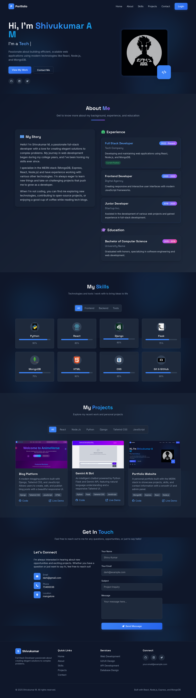
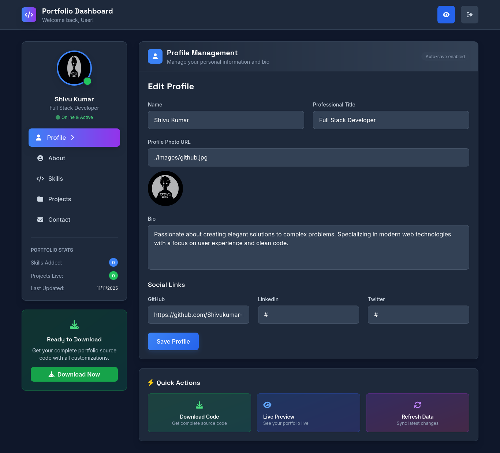

# 🚀 AI-Powered MERN Portfolio Builder

A full-stack dynamic portfolio website built using the **MERN** stack with **user authentication**, **profile editor**, **project manager**, and **public portfolio mode**.  
Users can create an account, upload skills/projects, and generate a professional portfolio using AI suggestions.

---

## ✅ **Key Features**

### 🔐 **User Authentication**
- JWT-based login/signup
- Secure password hashing with bcrypt
- Profile dashboard for logged-in users

### 👤 **Dynamic Profile & Skills**
- Upload profile image, bio, and social links
- Add skills with icons, levels, and categories
- Public visitor mode shows default profile & skills

### 🧩 **Projects Showcase**
- Add, edit, and delete projects from dashboard
- GitHub link + Live demo button for each project
- Public visitors see default projects if no account exists


### 📎 **File Uploads**
- Upload profile images & project thumbnails
- Static image hosting via Express `/images`

### 🌍 **Public Portfolio Mode**
- Anyone visiting without login sees:
  ✅ Default profile  
  ✅ Default skills  
  ✅ Default projects  
- Prevents “empty site” issues

### 💾 **Download Portfolio Code**
- Users can generate & download portfolio as ZIP
- Ready-to-deploy React build

### 🧩 **Contact Form**
- Stores user messages into MongoDB
- Works even when user is logged out

---

## 🛠 Tech Stack

| Layer | Technology |
|-------|------------|
| Frontend | React, Vite, TailwindCSS, Axios |
| Backend | Node.js, Express.js |
| Database | MongoDB Atlas (Mongoose) |
| Auth | JWT, bcrypt |
| AI | OpenAI / Gemini API |
| Deployment | Vercel / Render |

---

## 📌 API Routes (Quick Overview)

| Route | Purpose |
|-------|---------|
| `/api/auth/login` | Login user |
| `/api/auth/register` | Register new user |
| `/api/profile` | CRUD on profile |
| `/api/skills` | Skill management |
| `/api/projects` | Project management |
| `/api/messages` | Save contact form messages |
| `/api/*/public` | Public fallback data without login |

---

## 📸 Screenshots

#### ✅ Home Page


#### ✅ Skills


---

## ✅ How It Works

| Action | Logged-in User | Visitor (No Login) |
|--------|----------------|--------------------|
| View Profile | Shows user’s saved profile | Shows default profile |
| Skills | Shows saved skills | Shows default skills |
| Projects | Shows saved projects | Shows default projects |
| Contact Form | Saves messages | Saves messages |
| AI Suggestions | ✅ Yes | ✅ Limited public mode |

---

## 📦 Installation

```bash
git clone https://github.com/YOUR_REPO/mern-portfolio
cd mern-portfolio
