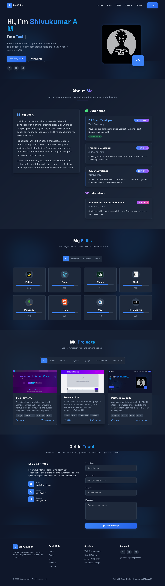
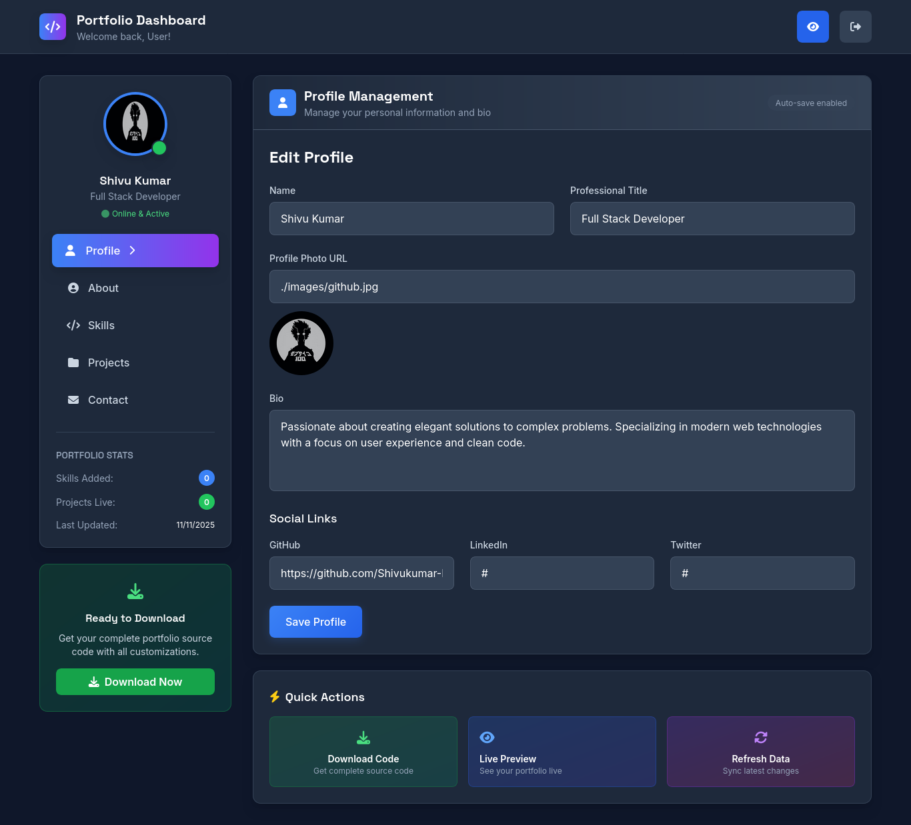

# MERN Portfolio Builder

A full-stack dynamic portfolio website built with the **MERN** stack. Users can register, log in, manage their profile and projects through a dashboard, and share a unique public portfolio URL. Visitors without an account see a default public portfolio.

---

## Features

### Authentication
- JWT-based register / login / logout
- Passwords hashed with bcryptjs
- Protected routes on both frontend and backend

### Dashboard
- Edit profile: name, title, bio, photo, social links
- Manage skills, projects, and about section via dedicated forms
- View and delete incoming contact messages (inbox)
- Download portfolio as a ZIP file (ready-to-deploy)

### Public Portfolio
- Every user gets a shareable URL: `/u/:username`
- Visitors who are not logged in see the owner's live data
- Unauthenticated access to the root `/` shows a default public portfolio

### Template Customizer
- Switch between five visual themes: **Cosmic**, **Glass**, **Magazine**, **Retro**, **Terminal**
- Preview and apply themes directly from the dashboard

### Contact Form
- Any visitor can submit a message without logging in
- Messages are stored in MongoDB and viewable by the portfolio owner

### File Uploads
- Upload profile photo and project thumbnail images
- Served as static assets via Express

---

## Tech Stack

| Layer | Technology |
|-------|------------|
| Frontend | React 19, Vite (rolldown), React Router 7, Axios |
| Styling | TailwindCSS |
| Backend | Node.js, Express 5 |
| Database | MongoDB (Mongoose 8) |
| Auth | JWT, bcryptjs |
| Extras | archiver (ZIP download), dotenv, cors |

---

## Project Structure

```
Portfolio/
├── backend/
│   ├── config/         # MongoDB connection
│   ├── controllers/    # Business logic (messages, projects)
│   ├── middleware/     # JWT auth middleware
│   ├── models/         # Mongoose schemas (User, Project, Skill, About, Message)
│   ├── routes/         # Express route handlers
│   │   ├── auth.js
│   │   ├── profile.js
│   │   ├── skills.js
│   │   ├── projects.js
│   │   ├── about.js
│   │   ├── contact.js
│   │   ├── messages.js
│   │   ├── publicPortfolio.js
│   │   └── download.js
│   └── server.js
├── frontend/
│   └── src/
│       ├── components/
│       │   ├── templates/   # Cosmic, Glass, Magazine, Retro, Terminal
│       │   ├── forms/       # Profile, Skills, Projects, About, Contact forms
│       │   ├── Dashboard.jsx
│       │   ├── PublicPortfolio.jsx
│       │   ├── TemplateCustomizer.jsx
│       │   ├── MessagesInbox.jsx
│       │   └── ParticleCanvas.jsx
│       ├── store/
│       │   └── AuthContext.jsx
│       └── App.jsx
├── images/              # Screenshot assets for README
└── template/            # Standalone HTML template files
```

---

## API Routes

| Method | Route | Auth | Description |
|--------|-------|------|-------------|
| POST | `/api/auth/register` | No | Register a new user |
| POST | `/api/auth/login` | No | Login and get JWT |
| GET/PUT | `/api/profile` | Yes | Get or update profile |
| GET/POST/PUT/DELETE | `/api/skills` | Yes | Manage skills |
| GET/POST/PUT/DELETE | `/api/projects` | Yes | Manage projects |
| GET/PUT | `/api/about` | Yes | Manage about section |
| POST | `/api/contact` | No | Submit contact form message |
| GET/DELETE | `/api/messages` | Yes | Read or delete inbox messages |
| GET | `/api/u/:username` | No | Public portfolio by username |
| GET | `/api/profile/public` | No | Default public profile fallback |
| GET | `/api/skills/public` | No | Default public skills fallback |
| GET | `/api/projects/public` | No | Default public projects fallback |
| GET | `/api/download` | Yes | Download portfolio as ZIP |

---

## Getting Started

### Prerequisites
- Node.js v18+
- MongoDB Atlas account (or local MongoDB)

### 1. Clone the repository

```bash
git clone https://github.com/Shivukumar-M/mern-portfolio.git
cd mern-portfolio
```

### 2. Configure the backend

```bash
cd backend
cp .env.example .env
```

Edit `.env`:

```env
MONGO_URI=your_mongodb_connection_string
JWT_SECRET=your_jwt_secret
PORT=5000
```

Install dependencies and start:

```bash
npm install
npm run dev
```

### 3. Configure the frontend

```bash
cd ../frontend
npm install
npm run dev
```

The frontend dev server runs on `http://localhost:5173` and proxies API requests to `http://localhost:5000`.

### 4. Build for production

```bash
cd frontend
npm run build
```

The output is in `frontend/dist/` and can be served from any static host (Vercel, Netlify, etc.).

---

## Screenshots

### Home Page


### Profile / Skills


---

## How It Works

| Feature | Logged-in User | Visitor |
|---------|---------------|---------|
| View portfolio | Own saved data | Default fallback data |
| Edit profile / skills / projects | Yes | No |
| Submit contact form | Yes | Yes |
| View messages inbox | Yes | No |
| Download portfolio ZIP | Yes | No |
| Public portfolio URL `/u/:username` | Yes | Yes |

---

## License

MIT
